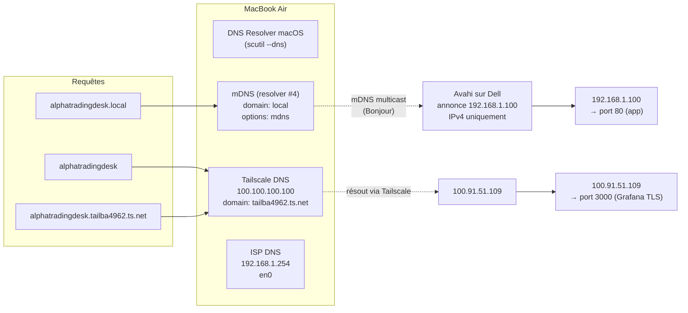
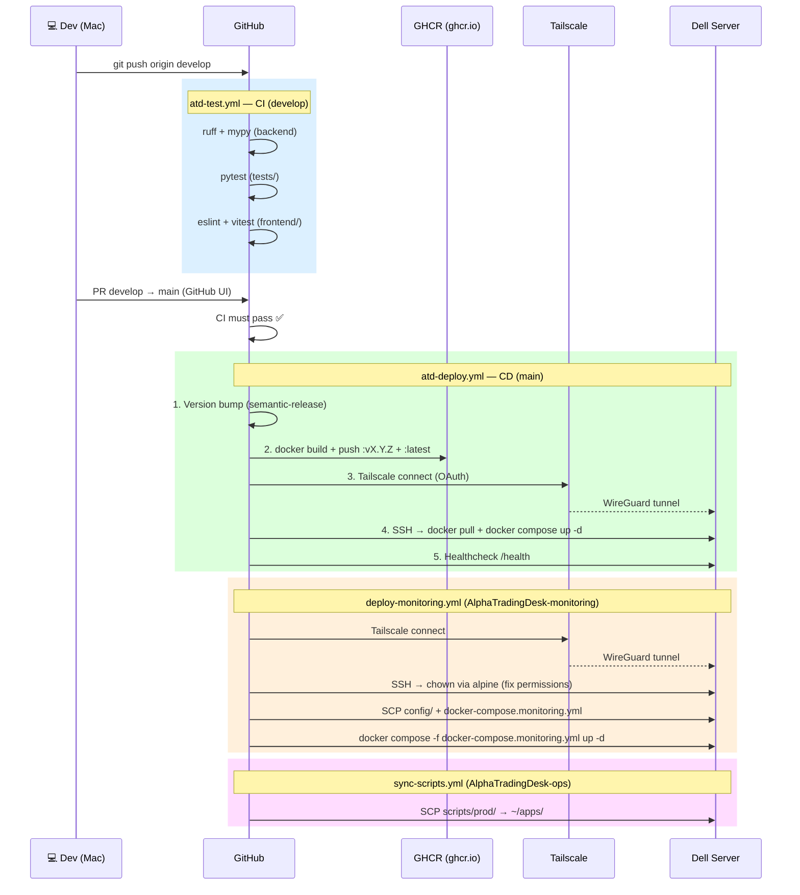
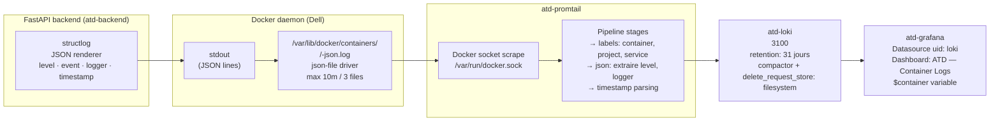

# 🏗️ Infrastructure Architecture — AlphaTradingDesk

**Version:** 1.0  
**Date:** 21 mars 2026  
**Scope:** Vue complète de l'infra — réseau, Docker, services, CI/CD, crons, observabilité

---

## 1. Vue d'ensemble — Infrastructure complète

```mermaid
graph TB
    subgraph Internet["🌐 Internet"]
        GH["GitHub\nghcr.io · github.com/lyoubimr\n3 repos"]
        TS_CTRL["Tailscale Control Plane\ncontrolplane.tailscale.com"]
        KRAKEN["Kraken API\nPhase 5"]
        BINANCE["Binance Futures API\n~50 paires"]
    end

    subgraph Mac["💻 MacBook Air (Dev)"]
        direction TB
        VENV["Python venv (.venv)\nPoetry · Python 3.11"]
        UVICORN["uvicorn --reload\n:8000"]
        VITE["Vite dev server\n:5173"]
        TS_MAC["Tailscale\n100.122.133.71"]
        DOCKER_DEV["Docker Compose Dev\ndocker-compose.dev.yml"]
        ADMINER["Adminer\n:8080"]
    end

    subgraph LAN["🏠 LAN — 192.168.1.0/24"]
        ROUTER["Box ISP\n192.168.1.254\nDHCP · DNS · mDNS proxy"]
        AVAHI_NOTE["⚠️ mDNS\nAvahi IPv6 désactivé\n→ .local stable"]
    end

    subgraph Dell["🖥️ Dell Server — Ubuntu — 192.168.1.100"]
        direction TB

        subgraph Network["Réseaux Docker"]
            NET_APPS["apps_default\n(bridge)"]
            NET_MON["atd-monitoring\n(bridge)"]
        end

        subgraph MainStack["📦 apps stack — docker-compose.prod.yml"]
            direction LR
            FE["atd-frontend\nnginx:alpine\n:80 → :443"]
            BE["atd-backend\nFastAPI · uvicorn\n:8000\nstructlog JSON"]
            DB["atd-db\ntimescale/timescaledb:pg16\n:5432\nTimescaleDB extension"]
            REDIS["atd-redis\nredis:7-alpine\n:6379"]
            CELERY_W["atd-celery-worker\nCelery Worker\nvolatility tasks"]
            CELERY_B["atd-celery-beat\nCelery Beat\nscheduler"]
        end

        subgraph MonitoringStack["📊 atd-monitoring stack — docker-compose.monitoring.yml"]
            direction LR
            PROMTAIL["atd-promtail\ngrafana/promtail:3.4.2\nscrape Docker socket"]
            LOKI["atd-loki\ngrafana/loki:3.4.2\n:3100\n31 jours rétention"]
            GRAFANA["atd-grafana\ngrafana/grafana:11.5.2\ninternal only"]
            NGINX_TLS["atd-grafana-proxy\nnginx:1.27-alpine\n:3000 HTTPS TLS"]
        end

        subgraph Storage["💾 Stockage"]
            VOL_PG["postgres_data\n(Docker volume)"]
            VOL_LOKI["loki_data\n(Docker volume)"]
            VOL_GF["grafana_data\n(Docker volume)"]
            BACKUPS["/srv/atd/backups/\nrolling · weekly"]
            CERTS["/srv/atd/certs/\natd.crt + atd.key\nself-signed TLS"]
            LOGS["/srv/atd/logs/\napp/ · cron/"]
            DATA["/srv/atd/data/"]
        end

        subgraph Avahi["🔍 mDNS"]
            AVAHI["avahi-daemon 0.8\nuse-ipv6=no\n→ alphatradingdesk.local\n→ 192.168.1.100"]
        end

        subgraph Tailscale_Dell["🔒 Tailscale"]
            TS_DELL["tailscale0\n100.91.51.109\nDNS: 100.100.100.100\ndomain: tailba4962.ts.net"]
        end

        SOCK["/var/run/docker.sock"]
        DOCKER_CONT["/var/lib/docker/containers/\n(logs JSON)"]
    end

    subgraph Browser["🌐 Navigateur"]
        UI_LAN["LAN: http://alphatradingdesk.local"]
        UI_TS["Tailscale: https://alphatradingdesk:3000\n(Grafana)"]
    end

    %% Réseau LAN
    ROUTER --- LAN
    AVAHI -. "mDNS broadcast\n.local IPv4 only" .-> ROUTER
    ROUTER -. "résolution\nalphatradingdesk.local" .-> UI_LAN

    %% Tailscale
    TS_CTRL -. "WireGuard tunnel" .-> TS_MAC
    TS_CTRL -. "WireGuard tunnel" .-> TS_DELL

    %% Dev workflow
    Mac --> LAN

    %% Main stack connections
    FE --> BE
    BE --> DB
    BE --> REDIS
    CELERY_W --> DB
    CELERY_W --> REDIS
    CELERY_B --> REDIS
    DB --- VOL_PG

    %% Monitoring connections
    SOCK --> PROMTAIL
    DOCKER_CONT --> PROMTAIL
    PROMTAIL --> LOKI
    LOKI --> GRAFANA
    GRAFANA --> NGINX_TLS
    LOKI --- VOL_LOKI
    GRAFANA --- VOL_GF
    CERTS --> NGINX_TLS

    %% External API
    CELERY_W -. "Binance Futures API" .-> BINANCE

    %% Browser access
    UI_LAN --> FE
    UI_TS --> NGINX_TLS

    %% CI/CD
    GH -. "docker pull +\ndocker compose up" .-> Dell
    GH -. "SCP config via Tailscale" .-> MonitoringStack
```



---

## 2. Réseau — Who resolves what



---

## 3. Celery Beat — Tâches planifiées (Phase 2)

```mermaid
gantt
    title Celery Beat — Schedule des tâches recurrentes
    dateFormat HH:mm
    axisFormat %H:%M

    section Volatility
    Market VI (toutes les 4h)         :active, 00:00, 4h
    Per-Pair VI update (toutes les 4h):active, 00:00, 4h

    section Watchlist
    Watchlist refresh (lundi 01:00 UTC):milestone, 01:00, 0h

    section Alerting
    Telegram alert check (15 min)     :active, 00:00, 15m
```



```
Celery Beat tasks (src/volatility/ + src/watchlist/)
├── update_market_vi        — toutes les 4h — calcul VI global (~50 paires Binance Futures)
├── update_per_pair_vi      — toutes les 4h — 317 paires Kraken, 5 indicateurs, 5 TF
├── refresh_watchlist       — lundi 01:00 UTC — tri VI+EMA, export TV format
└── send_telegram_alerts    — toutes les 15 min — Market VI + Watchlists + cooldown configurable
```

---

## 4. Crons OS — Dell (atd user)

```
crontab -l (atd user — managed by setup-cron.sh)
┌─────────────────────────────────────────────────────────────────────────────────┐
│ # DB backup rolling — toutes les 6 heures — garde 48 fichiers (~12 jours)       │
│ 0 */6 * * *    ~/apps/backup-db.sh rolling >> /srv/atd/logs/cron/backup-db.log  │
│                                                                                  │
│ # DB backup weekly — tous les dimanches 03:00 — garde 13 fichiers (~3 mois)     │
│ 0 3 * * 0      ~/apps/backup-db.sh weekly  >> /srv/atd/logs/cron/backup-db.log  │
│                                                                                  │
│ # Log rotation — tronque les .log > 100MB à 50MB (quotidien 01:00)              │
│ 0 1 * * *      find /srv/atd/logs/app -name "*.log" -size +100M ...             │
│                                                                                  │
│ # OS update + reboot — 3ème dimanche du mois 03:00                              │
│ 0 3 15-21 * 0  ~/apps/update-server.sh >> /srv/atd/logs/cron/update-server.log  │
└─────────────────────────────────────────────────────────────────────────────────┘
```

---

## 5. CI/CD Pipeline — 3 repos



---

## 6. Pipeline de logs — structlog → Grafana



---

## 7. Stockage — Dell (/srv/atd/)

```
/srv/atd/
├── backups/
│   ├── rolling/         ← backup-db.sh rolling (max 48 fichiers, ~12 jours)
│   └── weekly/          ← backup-db.sh weekly (max 13 fichiers, ~3 mois)
├── certs/
│   ├── atd.crt          ← TLS self-signed (nginx grafana proxy)
│   └── atd.key
├── data/                ← données persistantes app
├── logs/
│   ├── app/             ← logs app (.log, tronqués > 100MB)
│   └── cron/            ← backup-db.log, update-server.log

~/apps/                  ← scripts prod (sync depuis AlphaTradingDesk-ops)
├── docker-compose.prod.yml
├── .env                 ← vars runtime (SECRET_KEY, REDIS_URL, APP_ENV…)
├── backup-db.sh
├── deploy.sh
├── healthcheck.sh
├── setup-cron.sh
├── setup-logrotate.sh
├── setup-server.sh
├── setup-ssl.sh
├── update-server.sh
└── README.md

/srv/atd/.env.db         ← DB secrets (POSTGRES_PASSWORD, POSTGRES_USER, POSTGRES_DB)
                           sourcé par deploy.sh (set -a; source; set +a)

~/monitoring/            ← config monitoring (sync depuis AlphaTradingDesk-monitoring CI/CD)
├── docker-compose.monitoring.yml
└── config/
    ├── loki/loki.yml
    ├── promtail/promtail.yml
    ├── grafana/provisioning/
    │   ├── datasources/loki.yml    (uid: loki)
    │   └── dashboards/dashboards.yml
    └── grafana/dashboards/atd-logs.json
```

---

## 8. Stack complète — Résumé des versions

| Composant | Image / Version | Phase | Rôle |
|-----------|----------------|-------|------|
| **Frontend** | React 19 · Vite 8 · TypeScript | P1 | SPA trading UI |
| **Backend** | FastAPI · Python 3.11 · uvicorn | P1 | API REST |
| **ORM** | SQLAlchemy 2.0 · Alembic | P1 | Migrations |
| **DB** | timescale/timescaledb:latest-pg16 | P1/P2 | PostgreSQL 16 + TimescaleDB hypertables |
| **Cache** | redis:7-alpine | P2 | Broker Celery · cache |
| **Worker** | Celery 5+ | P2 | Tâches asynchrones volatilité |
| **Scheduler** | Celery Beat | P2 | Cron applicatif (VI, watchlist, alertes) |
| **Container** | Docker + Compose | P1 | Isolation services |
| **Registry** | GHCR (ghcr.io) | P1 | Images Docker versionnées |
| **CI/CD** | GitHub Actions | P1 | Test + build + deploy |
| **VPN** | Tailscale (WireGuard) | P1 | CI/CD deploy tunnel + accès distant |
| **mDNS** | Avahi 0.8 (use-ipv6=no) | P1 | alphatradingdesk.local → 192.168.1.100 |
| **Log collector** | grafana/promtail:3.4.2 | P4B | Scrape Docker socket |
| **Log storage** | grafana/loki:3.4.2 | P4B | 31 jours, compactor filesystem |
| **Dashboards** | grafana/grafana:11.5.2 | P4B | Visualisation logs |
| **TLS proxy** | nginx:1.27-alpine | P4B | HTTPS :3000 pour Grafana |
| **Logging lib** | structlog | P4B | JSON structuré dans FastAPI |
| **OS Crons** | crontab (atd user) | P1 | Backup DB rolling/weekly · logrotate · OS update |
