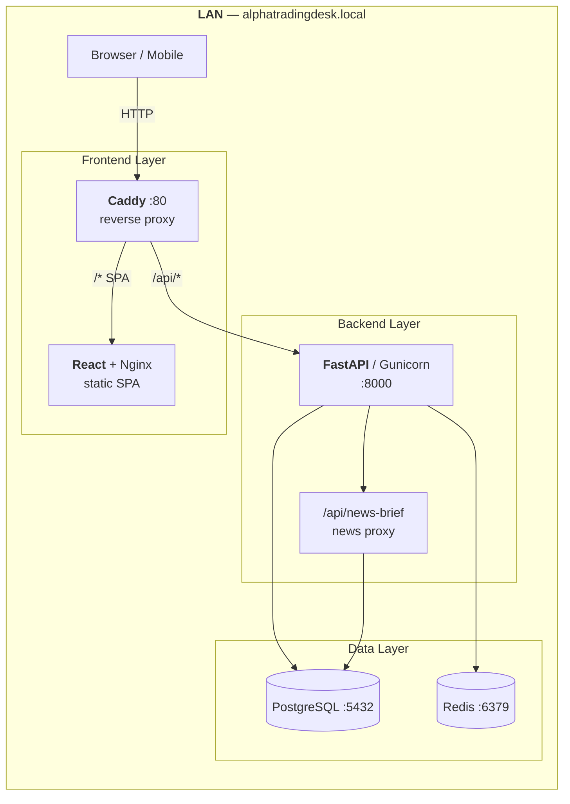
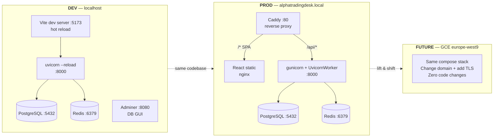
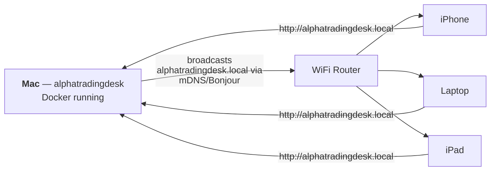

# 🏗️ System Architecture — AlphaTradingDesk

**Version:** 1.1 — Phase 1  
**Date:** March 1, 2026

---

## Docker Services Overview

---

## Dev vs Prod vs Future

---

## LAN Domain Resolution — mDNS / Bonjour

