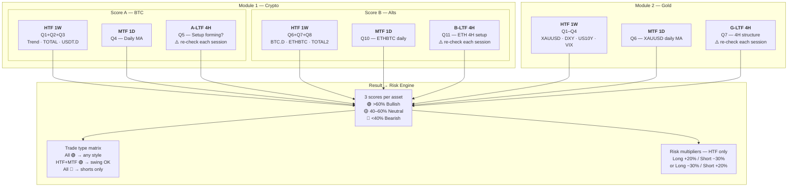

# 📊 Phase 1 — Feature Data Flow

**Version:** 1.1  
**Date:** March 1, 2026

---

## Full Feature Integration Flow

```mermaid
%%{init: {"flowchart": {"htmlLabels": false}} }%%
flowchart TD
    USER(["`👤 User`"])

    subgraph MA["`🔍 Market Analysis Module`"]
        direction TB
        MA1["`Open /market-analysis/new
        Select module: Crypto / Gold`"]
        MA2{"`News Intelligence
        enabled?`"}
        MA3["`Step 0 — Fetch News Brief
        POST /api/news-brief`"]
        MA4["`Backend proxies Perplexity / Grok
        API key never leaves server`"]
        MA5["`News context stored
        sentiment · themes · risks`"]
        MA6["`Step 1–N: Technical questions
        HTF / MTF / LTF per TF`"]
        MA7["`3-TF scores computed
        A-HTF · A-MTF · A-LTF
        B-HTF · B-MTF · B-LTF`"]
        MA8["`Summary shown
        Tech alignment + News context
        Risk multipliers set from HTF`"]
        MA1 --> MA2
        MA2 -->|Yes| MA3
        MA3 --> MA4 --> MA5 --> MA6
        MA2 -->|No / Skip| MA6
        MA6 --> MA7 --> MA8
    end

    subgraph TF["`📝 Trade Form`"]
        direction TB
        TF1["`Select Instrument
        from broker catalog`"]
        TF2["`Direction: LONG / SHORT`"]
        TF3["`Entry / SL / TP1–3
        TP profit preview live`"]
        TF4["`Risk % pre-filled
        × analysis bias multiplier`"]
        TF5{"`Check available
        risk budget`"}
        TF6["`Position size / leverage
        margin calculated live`"]
        TF7["`⚠️ Nudge: risk budget exceeded`"]
        TF8["`Save trade
        session_tag auto-set`"]
        TF1 --> TF2 --> TF3 --> TF4 --> TF5
        TF5 -->|OK| TF6 --> TF8
        TF5 -->|Over budget| TF7 --> TF6
    end

    subgraph TL["`⚡ Trade Lifecycle`"]
        direction TB
        TL1["`Open trade
        current_risk = risk_amount`"]
        TL2{"`Action?`"}
        TL3["`Move SL to BE
        current_risk → 0
        Risk budget restored`"]
        TL4["`Partial close TP1
        realized_pnl computed
        Prompt: move to BE?`"]
        TL5["`Full close
        realized_pnl final`"]
        TL1 --> TL2
        TL2 -->|BE action| TL3
        TL2 -->|Partial TP| TL4
        TL4 -.->|Yes → BE| TL3
        TL2 -->|Full close| TL5
    end

    subgraph GR["`🎯 Goals & Risk Dashboard`"]
        direction TB
        GR1["`Daily / Weekly / Monthly
        progress bars — all visible`"]
        GR2["`Style selector
        Scalping / Day / Swing / Position`"]
        GR3{"`Limit hit?`"}
        GR4["`🛑 BLOCKED banner
        + override button`"]
        GR5["`✅ ON TRACK / ⚠️ WARNING`"]
        GR1 --> GR2 --> GR3
        GR3 -->|Yes| GR4
        GR3 -->|No| GR5
    end

    USER --> MA1
    USER --> TF1
    MA8 -->|"HTF bias badge + news badge injected into form"| TF4
    TF8 --> TL1
    TL3 --> GR1
    TL4 --> GR1
    TL5 --> GR1
```

---

## News Intelligence — Backend Proxy Flow

```mermaid
%%{init: {"flowchart": {"htmlLabels": false}} }%%
flowchart LR
    FE["`**Frontend**
    /market-analysis/new`"]
    BE["`**FastAPI**
    /api/news-brief`"]
    DB_KEY[("DB
    AES-256 encrypted key")]
    MEM["`Memory
    decrypted key — never logged`"]
    PPLX["`**Perplexity / Grok**
    API`"]
    RESP["`JSON response
    sentiment · themes · risks`"]
    DB_SAVE[("DB
    market_analysis_sessions
    news_* columns")]

    FE -->|"POST {profile_id, module}"| BE
    BE -->|fetch encrypted key| DB_KEY
    DB_KEY -->|AES decrypt| MEM
    MEM -->|"Bearer token + prompt"| PPLX
    PPLX -->|structured JSON| RESP
    RESP -->|validate + save| DB_SAVE
    RESP -->|"return to frontend — no key, no raw prompt"| FE
```

---

## Market Analysis — 3-TF Score Model

