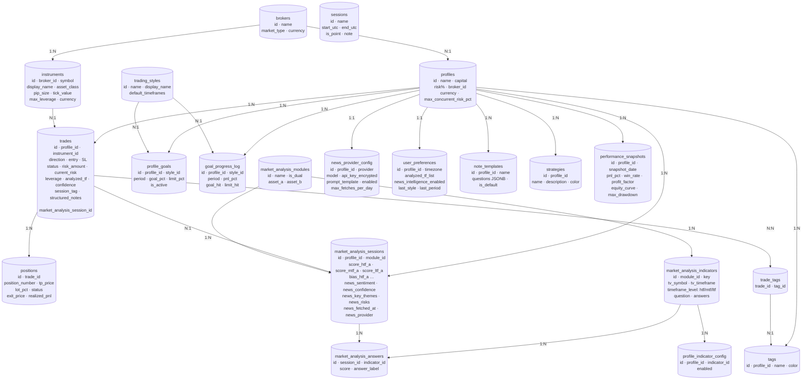
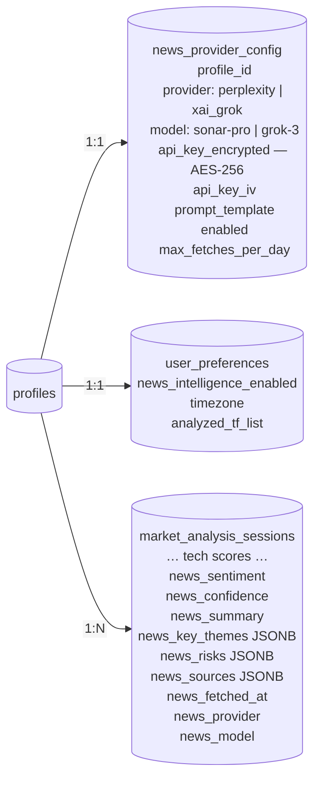

# 🗄️ Phase 1 — Database Schema Diagram

**Version:** 1.1  
**Date:** March 1, 2026

---

## Core Tables Relationships

```mermaid
%%{init: {"flowchart": {"htmlLabels": false}} }%%
flowchart TD
    profiles[("profiles
    id · name · capital
    risk% · broker_id
    currency · max_concurrent_risk_pct")]
    brokers[("brokers
    id · name
    market_type · currency")]
    instruments[("instruments
    id · broker_id · symbol
    display_name · asset_class
    pip_size · tick_value
    max_leverage · currency")]

    trades[("trades
    id · profile_id · instrument_id
    direction · entry · SL
    status · risk_amount · current_risk
    leverage · analyzed_tf · confidence
    session_tag · structured_notes
    market_analysis_session_id")]
    positions[("positions
    id · trade_id
    position_number · tp_price
    lot_pct · status
    exit_price · realized_pnl")]

    trading_styles[("trading_styles
    id · name · display_name
    default_timeframes")]
    profile_goals[("profile_goals
    id · profile_id · style_id
    period · goal_pct · limit_pct
    is_active")]
    goal_progress_log[("goal_progress_log
    id · profile_id · style_id
    period · pnl_pct
    goal_hit · limit_hit")]

    market_analysis_modules[("market_analysis_modules
    id · name · is_dual
    asset_a · asset_b")]
    market_analysis_indicators[("market_analysis_indicators
    id · module_id · key
    tv_symbol · tv_timeframe
    timeframe_level: htf/mtf/ltf
    question · answers")]
    market_analysis_sessions[("market_analysis_sessions
    id · profile_id · module_id
    score_htf_a · score_mtf_a · score_ltf_a
    bias_htf_a …
    news_sentiment · news_confidence
    news_key_themes · news_risks
    news_fetched_at · news_provider")]
    market_analysis_answers[("market_analysis_answers
    id · session_id · indicator_id
    score · answer_label")]
    profile_indicator_config[("profile_indicator_config
    id · profile_id · indicator_id
    enabled")]

    news_provider_config[("news_provider_config
    id · profile_id · provider
    model · api_key_encrypted
    prompt_template · enabled
    max_fetches_per_day")]

    sessions[("sessions
    id · name
    start_utc · end_utc
    is_point · note")]
    user_preferences[("user_preferences
    id · profile_id · timezone
    analyzed_tf_list
    news_intelligence_enabled
    last_style · last_period")]

    note_templates[("note_templates
    id · profile_id · name
    questions JSONB · is_default")]
    strategies[("strategies
    id · profile_id
    name · description · color")]
    tags[("tags
    id · profile_id · name · color")]
    trade_tags[("trade_tags
    trade_id · tag_id")]
    performance_snapshots[("performance_snapshots
    id · profile_id · snapshot_date
    pnl_pct · win_rate · profit_factor
    equity_curve · max_drawdown")]

    brokers -->|1:N| instruments
    brokers -->|N:1| profiles
    profiles -->|1:N| trades
    profiles -->|1:N| profile_goals
    profiles -->|1:N| goal_progress_log
    profiles -->|1:1| user_preferences
    profiles -->|1:1| news_provider_config
    profiles -->|1:N| market_analysis_sessions
    profiles -->|1:N| performance_snapshots
    profiles -->|1:N| strategies
    profiles -->|1:N| tags
    profiles -->|1:N| note_templates
    instruments -->|N:1| trades
    trades -->|1:N| positions
    trades -->|N:1| market_analysis_sessions
    trades -->|N:N| trade_tags
    trade_tags -->|N:1| tags
    trading_styles -->|N:1| profile_goals
    trading_styles -->|N:1| goal_progress_log
    market_analysis_modules -->|1:N| market_analysis_indicators
    market_analysis_modules -->|1:N| market_analysis_sessions
    market_analysis_indicators -->|1:N| market_analysis_answers
    market_analysis_indicators -->|1:N| profile_indicator_config
    market_analysis_sessions -->|1:N| market_analysis_answers
```

---

## News Intelligence — Key Tables

```mermaid
%%{init: {"flowchart": {"htmlLabels": false}} }%%
flowchart LR
    profiles[("profiles")]

    npconf[("news_provider_config
    profile_id
    provider: perplexity | xai_grok
    model: sonar-pro | grok-3
    api_key_encrypted — AES-256
    api_key_iv
    prompt_template
    enabled
    max_fetches_per_day")]

    sessions_tbl[("market_analysis_sessions
    … tech scores …
    news_sentiment
    news_confidence
    news_summary
    news_key_themes JSONB
    news_risks JSONB
    news_sources JSONB
    news_fetched_at
    news_provider
    news_model")]

    user_pref[("user_preferences
    news_intelligence_enabled
    timezone
    analyzed_tf_list")]

    profiles -->|1:1| npconf
    profiles -->|1:1| user_pref
    profiles -->|1:N| sessions_tbl
```
