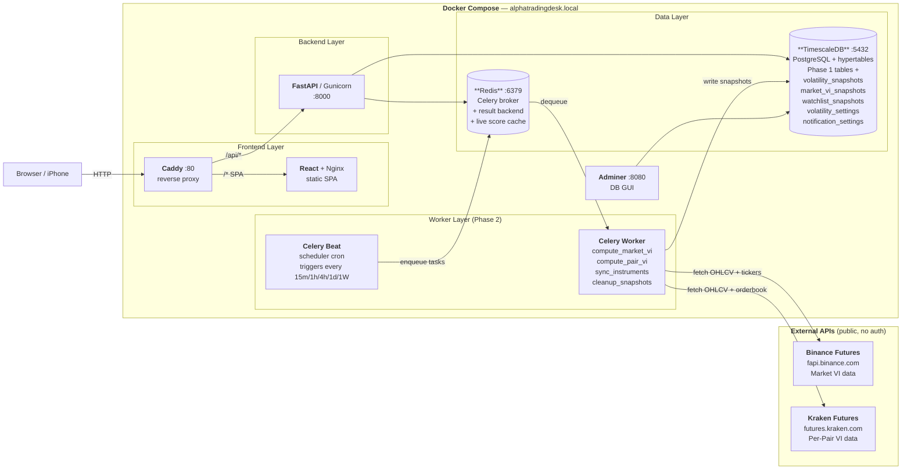
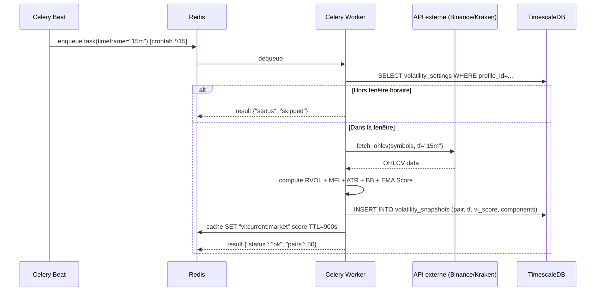

# 🏗️ Phase 2 — System Architecture

**Version:** 1.0
**Date:** 14 mars 2026
**Phase:** 2 — Volatility Engine

---

## Services Overview (Phase 2)

Phase 2 ajoute 3 nouveaux services au stack existant :
- **Redis** — broker Celery + cache scores live
- **Celery Worker** — exécute les tâches de calcul VI
- **Celery Beat** — planificateur (déclencheur cron)

TimescaleDB est activé comme **extension** du PostgreSQL existant (pas un nouveau conteneur).

---

## Dev vs Prod (Phase 2)

```mermaid
%%{init: {"flowchart": {"htmlLabels": false}} }%%
flowchart LR
    subgraph DEV["`**DEV** — localhost (Mac)`"]
        direction TB
        vite["`Vite :5173 HMR`"]
        uvi["`uvicorn --reload :8000`"]
        w_dev["`celery worker (local)`"]
        b_dev["`celery beat (local)`"]
        pg_dev[("TimescaleDB :5432")]
        red_dev[("Redis :6379")]
        uvi --> pg_dev
        uvi --> red_dev
        b_dev --> red_dev
        red_dev --> w_dev
    end

    subgraph PROD["`**PROD** — alphatradingdesk.local (Dell)`"]
        direction TB
        caddy_p["`Caddy :80`"]
        gunicorn_p["`gunicorn :8000`"]
        w_p["`celery worker (container)`"]
        b_p["`celery beat (container)`"]
        pg_p[("TimescaleDB :5432")]
        red_p[("Redis :6379")]
        caddy_p --> gunicorn_p
        gunicorn_p --> pg_p
        gunicorn_p --> red_p
        b_p --> red_p
        red_p --> w_p
    end

    DEV -.->|même codebase, même config env| PROD
```

---

## Flux Beat → Worker → DB

</content>
</invoke>