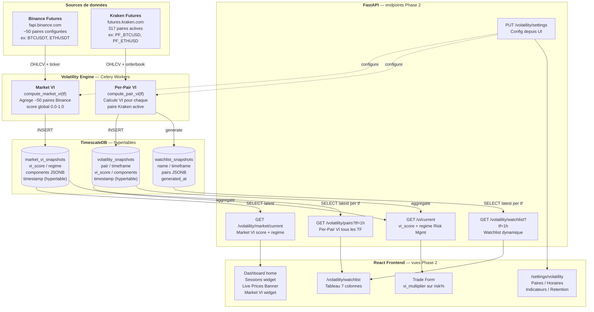
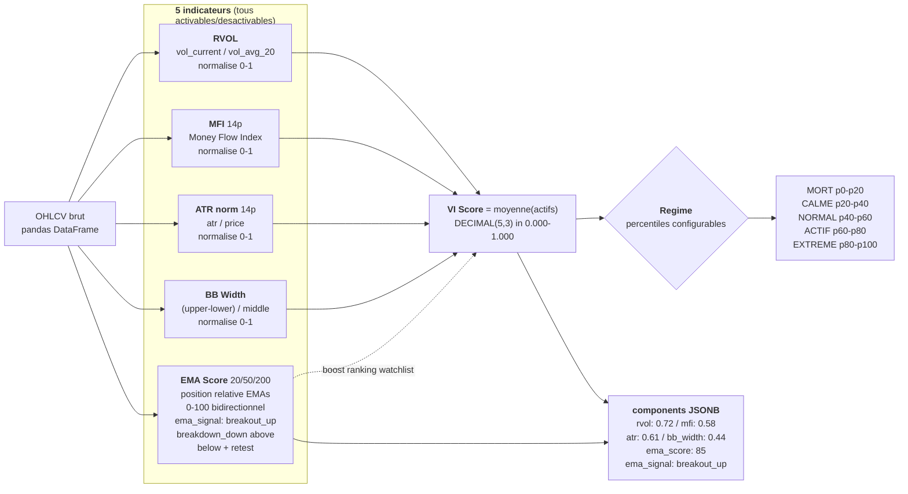
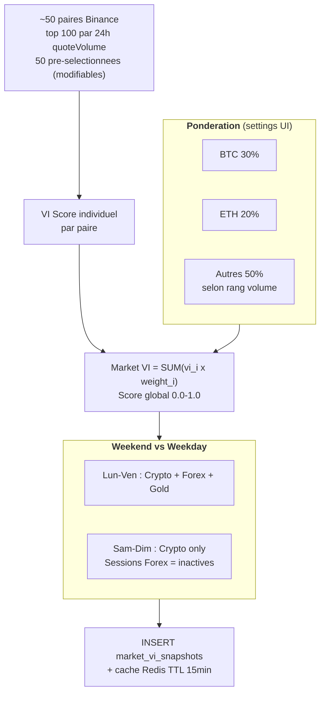
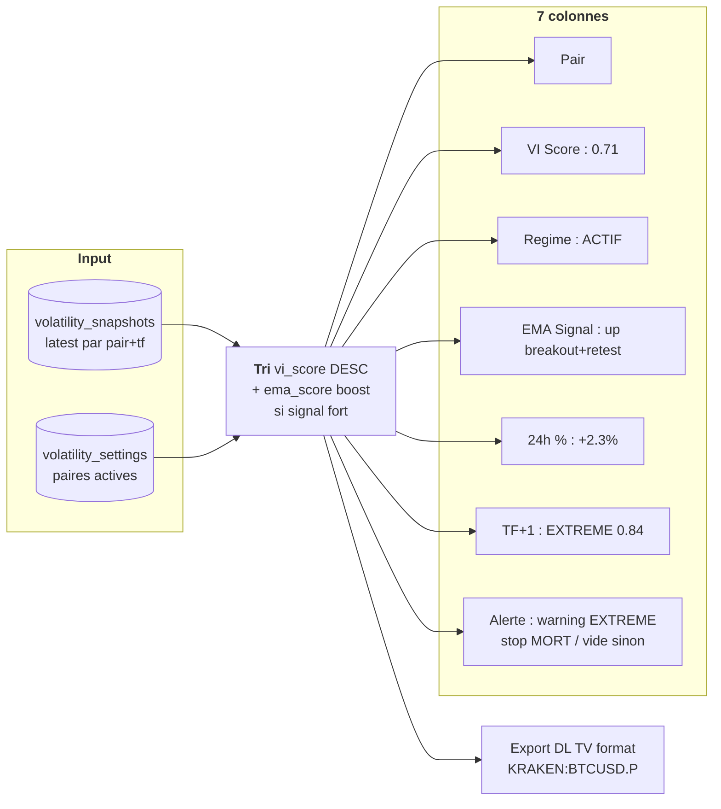

# 📊 Phase 2 — Volatility Engine Data Flow

**Version:** 1.0
**Date:** 14 mars 2026
**Phase:** 2 — Volatility Engine

---

## Vue d'ensemble — Deux composants indépendants

---

## Calcul VI — Pipeline indicateurs

---

## Market VI — Agregation globale

---

## Watchlist — Colonnes et generation

**Hierarchie TF+1** : 15m→1h → 4h → 1d → 1W (masque si 1W)
