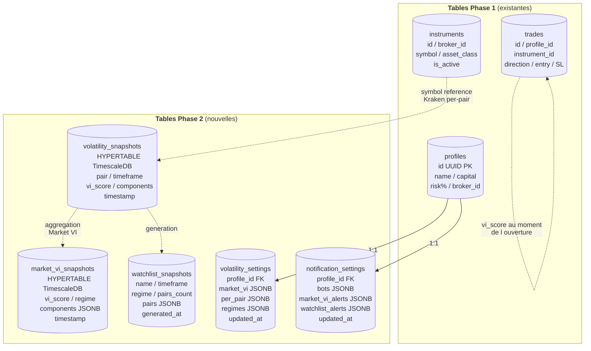
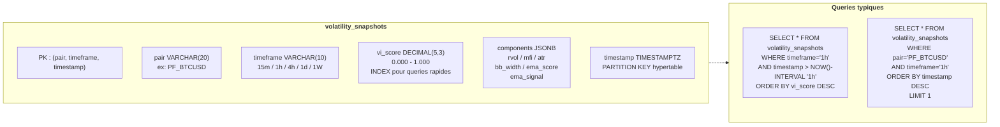
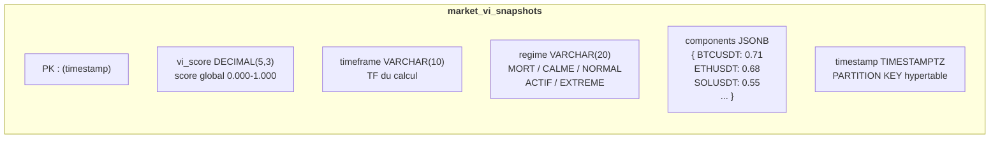
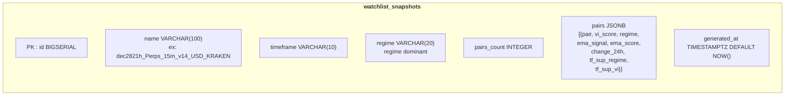
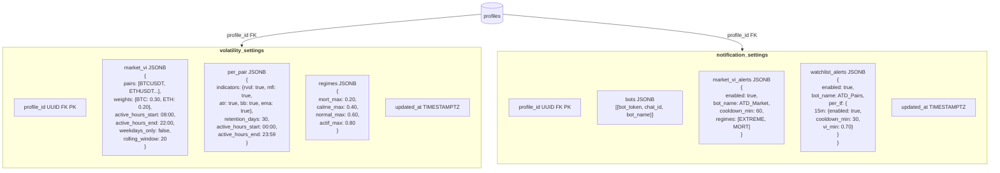
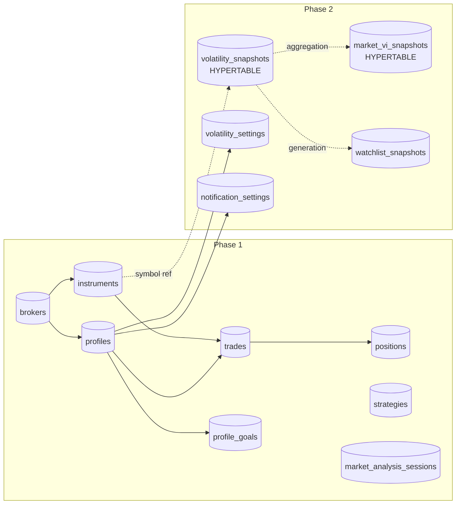

# 🗄️ Phase 2 — Database Schema

**Version:** 1.0
**Date:** 14 mars 2026
**Phase:** 2 — Volatility Engine

---

## Nouvelles tables Phase 2

5 nouvelles tables ajoutées au schema Phase 1 existant.
`volatility_snapshots` et `market_vi_snapshots` sont des **hypertables TimescaleDB**.

---

## Relations avec Phase 1

---

## volatility_snapshots (hypertable)

Stocke le VI calculé pour chaque paire Kraken, par timeframe.
Chunk interval = 1 jour. Compression automatique après 7 jours.

---

## market_vi_snapshots (hypertable)

Stocke le score global du marche agrege sur les paires Binance.

---

## watchlist_snapshots

Snapshot genere apres chaque calcul per-pair. Conserve l'historique des watchlists.

---

## volatility_settings + notification_settings

Config JSONB par profil — tout configurable depuis l'UI, aucune migration pour ajouter un parametre.

---

## Schema complet Phase 1 + Phase 2

