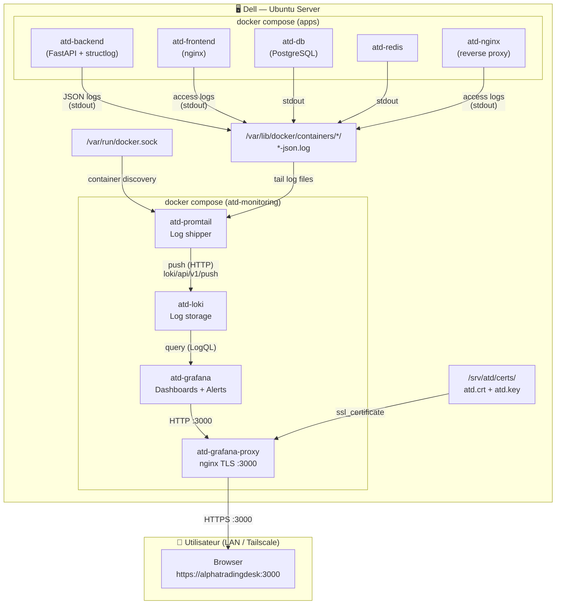
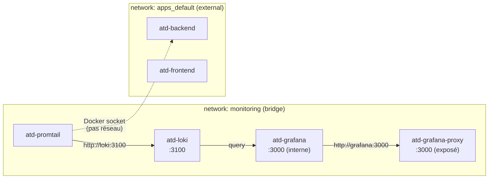
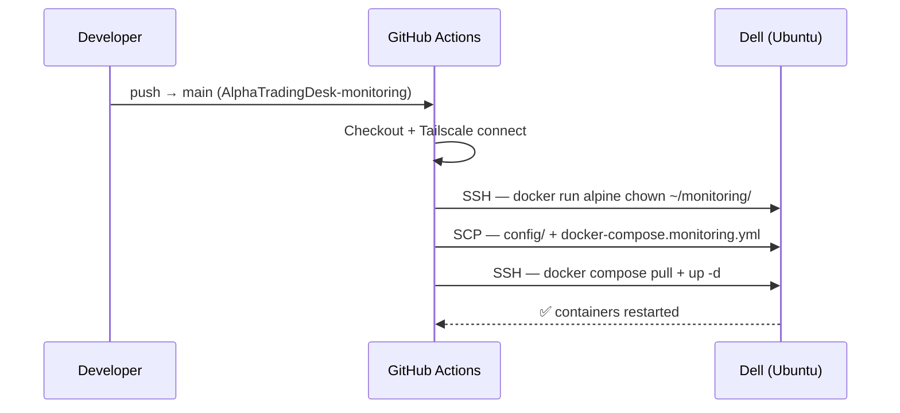

# 🪵 Phase 4B — Logging Architecture

**Version:** 1.0
**Date:** 21 mars 2026
**Phase:** 4B — DevOps Logging (structlog + Loki + Grafana)

---

## Overview

Phase 4B ajoute un stack d'observabilité complet dans un repo séparé (`AlphaTradingDesk-monitoring`).  
Tous les containers du main stack sont observés — backend, frontend, db, nginx, redis.

---

## Architecture générale

---

## Pipeline de logs — détail

```mermaid
%%{init: {"flowchart": {"htmlLabels": false}} }%%
flowchart LR
    subgraph FASTAPI["FastAPI (atd-backend)"]
        CODE["logging.getLogger(__name__)\n.info('message')"]
        STDLIB["stdlib logging\n(ProcessorFormatter)"]
        STRUCTLOG["structlog\nJSONRenderer (prod)"]
    end

    subgraph DOCKER["Docker"]
        STDOUT["stdout\n(container log driver)"]
        JSONFILE["/var/lib/docker/containers/\nXXX-json.log\n{log: '{...}', stream: 'stdout', time: '...'}"]
    end

    subgraph PROMTAIL_PIPE["Promtail pipeline"]
        TAIL["tail log file"]
        PARSE1["stage: json\nextract 'log' field"]
        TS["stage: timestamp\n(RFC3339Nano)"]
        OUTPUT["stage: output\n(log = message)"]
        PARSE2["stage: json (nested)\nextract level, logger, message"]
        LABELS["stage: labels\nlevel=, logger=, stream="]
    end

    LOKI_STORE[("Loki\n(TSDB index\n+ chunks)")]

    CODE --> STDLIB --> STRUCTLOG
    STRUCTLOG -- "{'level':'info','message':'...','timestamp':'...'}" --> STDOUT
    STDOUT --> JSONFILE
    JSONFILE --> TAIL --> PARSE1 --> TS --> OUTPUT --> PARSE2 --> LABELS
    LABELS -- "HTTP push\nwith labels:\nproject=apps\ncontainer=atd-backend\nlevel=info" --> LOKI_STORE
```

---

## Labels Loki indexés

| Label | Source | Exemple |
|-------|--------|---------|
| `project` | `com.docker.compose.project` | `apps` |
| `container` | nom du container | `atd-backend`, `atd-frontend` |
| `service` | `com.docker.compose.service` | `backend`, `frontend` |
| `level` | extrait du JSON structlog | `info`, `warning`, `error` |
| `logger` | extrait du JSON structlog | `src.trades.router` |
| `stream` | stdout / stderr | `stdout` |

---

## Réseau Docker

> Promtail n'est **pas** connecté au réseau `apps_default` via TCP — il accède aux logs via le **socket Docker** monté en bind mount (`/var/run/docker.sock`), pas via le réseau.

---

## Rétention et persistance

| Données | Stockage | Survie |
|---------|----------|--------|
| Logs bruts | Named volume `atd-monitoring_loki_data` | Restart / redeploy |
| Rétention max | Configurée à **31 jours** dans `loki.yml` | Purge auto par compactor |
| Dashboards | Bind mount `~/monitoring/config/grafana/` | Sync avec git via CI |
| Config Grafana | Named volume `atd-monitoring_grafana_data` | Restart / redeploy |

---

## Repos impliqués

| Repo | Rôle |
|------|------|
| `AlphaTradingDesk` | `src/core/logging_config.py` — structlog JSON en prod |
| `AlphaTradingDesk-monitoring` | Stack Loki + Promtail + Grafana + CI/CD deploy |

---

## CI/CD deploy flow

